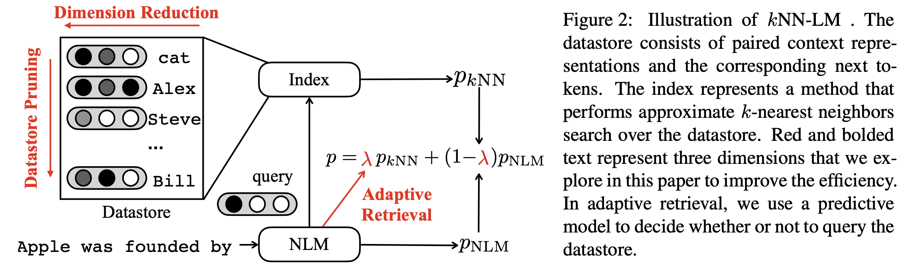

# Efficient Nearest Neighbor Language Models

This is implementation of the [paper](https://arxiv.org/abs/2109.04212):

```
Efficient Nearest Neighbor Language Models
Junxian He, Graham Neubig, Taylor Berg-Kirkpatrick
EMNLP 2021
```

This repo implements several techniques to speed up the evaluation of non-parametric, nearest neighbor language models. Specifically, we improve the efficiency along three axes: adaptive retrieval, datastore prunning, and dimension reduction. 




## Updates

**October 23, 2021** 

The original [knnlm](https://github.com/urvashik/knnlm) repo and our original code use [faiss](https://github.com/facebookresearch/faiss) CPU to perform retrieval, and most of the faiss [benchmarks](https://github.com/facebookresearch/faiss/wiki/Indexing-1G-vectors) are performed on a CPU environment. However, recently I was playing with faiss-gpu and found that the gpu faiss could reduce the evaluation latency significantly, at least in the WikiText-103 and Law-MT datasets. I would like to report the faiss-gpu results here for readers of interest to have a better understanding. The faiss-gpu here uses a 40GB A100 GPU (the LM is on the same GPU, i.e. we only need one GPU) and the faiss-cpu uses 32 CPU cores. 

We note that GPU memory is typically scarce resource, and both WikiText-103 and Law-MT here are not in a very large scale compared to other language modeling training corpus nowadays. Given that kNN-LM produces a vector for every single token, the resulted faiss index may not be able to fit into the GPU memory easily for larger datasets, which could prohibit using kNN-LM+faiss-gpu. See [here](https://github.com/facebookresearch/faiss/wiki/Faiss-on-the-GPU) for limitations of faiss-gpu.

*WikiText-103:*

| Method      | ppl | tokens/s     |
| :---        |    ----:   |          ---: |
| NLM      | 18.66       | 5559   |
| kNN-LM (faiss-cpu)   | 16.65        | 281      |
| kNN-LM (faiss-gpu)   | 16.65        | 3204    |
| efficient kNN-LM (faiss-cpu)   | 16.67        | 2015    |
| efficient kNN-LM (faiss-gpu)   | 16.67        | 4528    |

*Law-MT:*

| Method      | ppl | tokens/s     |
| :---        |    ----:   |          ---: |
| NLM      | 106.56       | 38.2K   |
| kNN-LM (faiss-cpu)   | 12.64        | 1230      |
| kNN-LM (faiss-gpu)   | 12.32        | 5781    |
| efficient kNN-LM (faiss-cpu)   | 12.29        | 6037  |
| efficient kNN-LM (faiss-gpu)   | 12.03        | 9214  |


## Install Dependencies

This repository is largly based on the [knnlm](https://github.com/urvashik/knnlm) repo which is a fork of [Fairseq](https://github.com/pytorch/fairseq) (commit [da544b](https://github.com/pytorch/fairseq/tree/6a5181509aa1fa7d260985157e77211753da544b)). Please use the exact commit page to determine software requirements for using this code. 

```bash
git clone git@github.com:jxhe/efficient-knnlm.git

cd efficient-knnlm
pip install --editable .

# install faiss gpu + cpu
conda install -c pytorch faiss-gpu

# install fass cpu only
# conda install -c pytorch faiss-cpu
```

#### Hardware

Experiments for this paper were conducted on machines that contain 32 CPUs, 100GB of RAM, and one NVIDIA 3090 24GB GPU. Saving the Wikitext-103 datastore requires 200GB of disk space. Note that the number of CPUs has a great impact on the speed. 

## Running Efficient kNNLM

### Preparation

**Data**

We share Fairseq's instructions on how to prepare the data here.

```bash
mkdir -p datasets/wikitext-103
cp examples/language_model/wikitext-103/prepare-wikitext-103.sh datasets/wikitext-103

cd datasets/wikitext-103
bash prepare-wikitext-103.sh
cd ../..

TEXT=datasets/wikitext-103
python preprocess.py \
    --only-source \
    --trainpref $TEXT/wiki.train.tokens \
    --validpref $TEXT/wiki.valid.tokens \
    --testpref $TEXT/wiki.test.tokens \
    --destdir data-bin/wikitext-103 \
    --workers 20
```

**Download the language model checkpoint pretrained on WikiText-103**
```bash
# the model checkpoint link is from the knnlm repo
wget https://nlp.stanford.edu/projects/knnlm/wt103_checkpoint_best.pt -P knnlm_ckpt
```

**Save the datastore**

```bash
mkdir -p dstore

python eval_lm.py data-bin/wikitext-103 \
    --path knnlm_ckpt/checkpoint_best.pt \
    --sample-break-mode none --max-tokens 3072 \
    --softmax-batch 1024 --gen-subset train \
    --context-window 1536 --tokens-per-sample 1536 \
    --dstore-mmap dstore/dstore --knn-keytype 'last_ffn_input' \
    --dstore-size 103225485 --model-overrides "{'knn_keytype': 'last_ffn_input'}" \
    --save-knnlm-dstore --fp16 --dstore-fp16
```

### Dimension Reduction 

```bash
# the script applies PCA of dimension 512 by default 
# the PCA hyperparameter can be tuned in this script
# set pca=0 to revert back to the vanilla version
bash ef_knnlm/build_faiss.sh
```

The faiss index is saved into `dstore`. Try it out:

```bash
bash ef_knnlm/utils_cmd/eval_knnlm.sh \
    -d wikitext-103 \
    -s valid \
    -p dstore/dstore_size103225485_embed1024_fp16 \
    -i dstore/knn.103225485.pca512.m64.index \
    -n 103225485 \
    # -g "True" \     # enable this to use GPU faiss
```

You should already observe a speedup. 

### Adaptive Retrieval

**prepare heldout data to train the retrieval adaptor**

```bash
# this randomly selects 90% of validation data as the training data to 
# train the retrieval adaptor
bash ef_knnlm/adaptive_retrieval/prepare_heldout.sh wikitext-103
```

**prepare features**

```bash
bash ef_knnlm/adaptive_retrieval/prepare_feature_pipeline.sh
```

**train**

```bash
bash ef_knnlm/adaptive_retrieval/train_ar.sh
```

It saves the retrieval adaptor checkpoints into `checkpoint/wikitext-103-valid`

**evaluation**

```shell
# the cutoff ratio in adaptive retrieval
# by default we cut off half of the retrieval
cutoff=50

# please change this to the .pt file path observed from the last step
ar_ckpt=xxx

# this hyperparameter needs to be changed if 
# the datastore sizes change (e.g. datastore pruning)
size=103225485

dstore_prefix=dstore/dstore_size${size}_embed1024_fp16
index_file=dstore/knn.${size}.pca512.m64.index

bash ef_knnlm/utils_cmd/eval_knnlm.sh \
    -d wikitext-103 \
    -s test \
    -p ${dstore_prefix} \
    -i ${index_file} \
    -c knnlm_ckpt/wt103_checkpoint_best.pt \
    -n ${size} \
    -f datasets/wikitext-103 \
    -a ctxt,freq,lm_ent,lm_max,fert \
    -u ${cutoff} \
    -h ${ar_ckpt} \
    # -w "True"  # read datastore weights file, required for greedy-merged datastore
    # -g "True" # enable this to use GPU faiss
```

### Datastore Pruning

**precompute all the retrieval results for every record in the datastore:**

```bash
# It is possible to parallel this operation by change 
# "--start-point" and "--num" arguments so that the training
# data would be splitted into multiple smaller ones. In this case
# the retrieval results would be saved into multiple files
bash ef_knnlm/dstore_compression/save_retrieval_results.sh
```
The retrieval results are saved into `dstore/greedy_merge`, other datastore pruning algorithms may be played around using these pre-computed results.

**greedy merging**

```bash
# perform greedy merging to yield a new smaller datastore, 
# and build faiss index from the new datastore
bash ef_knnlm/dstore_compression/greedy_merge.sh
```

The pruned datastore and index are saved into `dstore/greedy_merging`, replace the previous`dstore_prefix`/`index_file` with the new ones to use the pruned the datastore. The option `-w "True"`needs to be passed to `eval_knnlm.sh` to read the generated datastore weights file from greedy merging.


## Reference

```
@inproceedings{he2021eff,
title={Efficient Nearest Neighbor Language Models},
author={Junxian He and Graham Neubig and Taylor Berg-Kirkpatrick},
booktitle={Proceedings of EMNLP},
year={2021}
}
```

